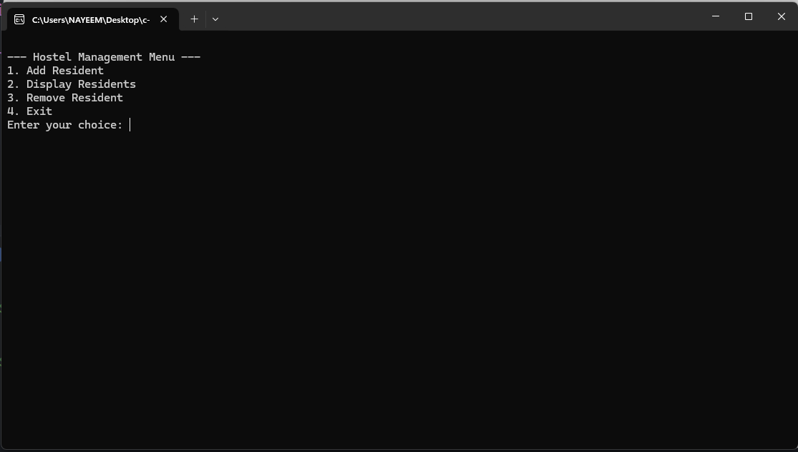
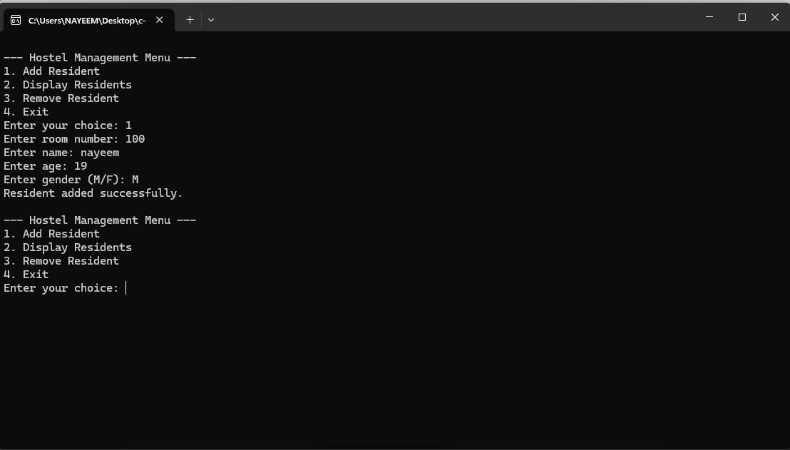
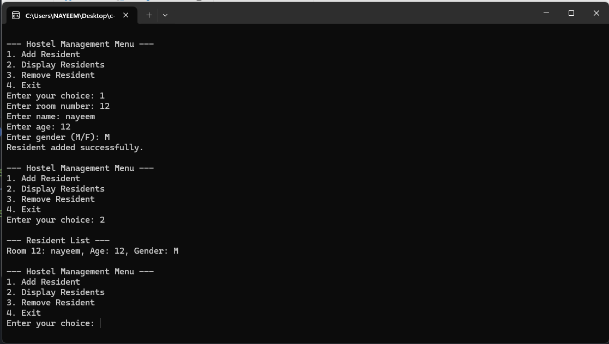

# 🏨 Hostel Management System
# Video Demo

👉 **[Click here to watch the demo video](https://youtu.be/NdH-h84pFfU)**

### 📚 Course: Software Development Capstone Project (SE133 - H2)
### 🏫 Department of Software Engineering
### 🏛️ Daffodil International University

---

## 👥 Group Members – Group 7

| Name | Student ID |
|---|---|
| Emtiaz Hossain | 242-35-744 |
| Arpita Barmon | 242-35-794 |
| Jahid Hossain | 242-35-142 |
| Mohammad Ali Nayeem | 242-35-022 |

---

## 📬 Submitted To:

#### **Sumona Afroz**
Lecturer
Department of Software Engineering
Daffodil International University

---

## 🧪 Sample Output Screenshots

### 🔸 Main Menu


### 🔸 Adding a Resident


### 🔸 Displaying All Residents


---

## 📌 Project Overview

This **Hostel Management System** is a foundational C programming project designed to automate basic hostel-related tasks, such as managing resident information and room assignments. It serves as an excellent capstone project to demonstrate core concepts of structured programming.

The project replaces a manual system with a basic, functional command-line application. It is ideal for students who want to apply and reinforce fundamental programming principles in a practical context.

---

## 🧠 Key Features

-   **Resident Management**: Add new residents with details such as name, age, gender, and room number.
-   **View All Residents**: Display a list of all current residents and their information.
-   **Resident Check-Out**: Remove a resident from a specific room.
-   **Interactive Menu**: A user-friendly, menu-driven interface to navigate all available operations.
-   **Modular Design**: The codebase is separated into multiple `.c` and `.h` files for improved readability, maintainability, and reusability.

---

## 📂 Project Structure

The project is designed with a clear, modular architecture to promote good programming practices.

-   `app.c`: The main entry point of the application. It initializes the system and controls the main program loop and menu.
-   `hostel.h`: The header file that defines the `Resident` struct and declares the core functions for adding, displaying, and removing residents.
-   `hostel.c`: Implements the functions declared in `hostel.h`, containing the core business logic of the system.
-   `utils.h`: A header file for utility functions, such as those related to the menu and user input validation.
-   `utils.c`: Implements the utility functions declared in `utils.h`.
-   `Makefile`: Automates the compilation and linking process, making it easy to build the executable.

---

## 🔧 Code Overview

### `hostel.h`
This header file defines the `Resident` data structure and declares the functions that will be used to manage resident information.

```c
#ifndef HOSTEL_H
#define HOSTEL_H


typedef struct {
    int roomNumber;
    char name[50];
    int age;
    char gender;
    int isOccupied;
} Resident;


void addResident(Resident residents[], int size);
void displayResidents(const Resident residents[], int size);
void removeResident(Resident residents[], int size);

#endif 
```

### `app.c`
This file would contain the main function `int main()`, which:
1. Declares an array of `Resident` structs to represent the hostel.
2. Presents a menu to the user in a loop.
3. Calls the appropriate functions from `hostel.c` and `utils.c` based on the user's choice.

---

## ▶️ Getting Started

To compile and run the project, you will need a C compiler (like `gcc`) and a `make` utility.

1.  **Clone the repository:**
    ```sh
    git clone [https://github.com/kazinayeem/hostel-management-capstone.git](https://github.com/kazinayeem/hostel-management-capstone.git)
    cd hostel-management
    ```

2.  **Compile the code using the `Makefile`:**
    ```sh
    make
    ```

3.  **Run the executable:**
    ```sh
    ./hostel_management
    ```

---


